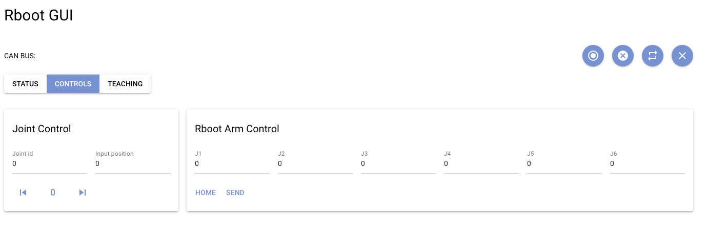
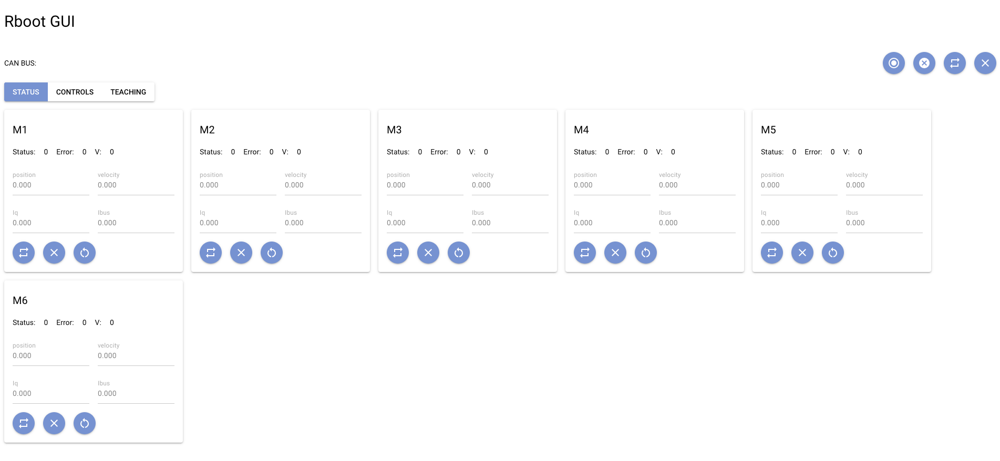

# ODrive GUI
Dummy2 simple web gui to configure rdrive and control dummy2 joints, also, it includes a status view of each rdrive(joints).

## gripper json file
gripper json example:
```json
[
    {
        "J1": -51.750349044799805,
        "J2": 0.23874833285808564,
        "J3": -15.4531099319458,
        "J4": 0.5866357684135437,
        "J5": -0.7649781346321106,
        "J6": 0.053393661975860596,
        "Delay": 1.5,
        "Gripper": 0,
        "Torque": 0.0
    },
    {
        "J1": -50.928537368774414,
        "J2": 50.650505447387694,
        "J3": -18.927996253967287,
        "J4": 0.7838403582572937,
        "J5": 32.39108047485352,
        "J6": 0.05419703722000122,
        "Delay": 1.5,
        "Gripper": 0,
        "Torque": 0.1
    },
    {
        "J1": -50.928537368774414,
        "J2": 50.650505447387694,
        "J3": -18.927996253967287,
        "J4": 0.7838403582572937,
        "J5": 32.39108047485352,
        "J6": 0.05419703722000122,
        "Delay": 1.5,
        "Gripper": 1,
        "Torque": 0.1
    },
    {
        "J1": 0.40264324843883514,
        "J2": 8.627429580688476,
        "J3": -48.7943172454834,
        "J4": -5.0593414306640625,
        "J5": 20.152667999267578,
        "J6": -177.8004409790039,
        "Delay": 1.5,
        "Gripper": 1,
        "Torque": 0.1
    },
    {
        "J1": 45.861568450927734,
        "J2": 64.63976440429687,
        "J3": -49.313441848754884,
        "J4": -5.075992584228516,
        "J5": 39.922393798828125,
        "J6": -177.80061950683594,
        "Delay": 1.5,
        "Gripper": 1,
        "Torque": 0.1
    },
    {
        "J1": 45.861568450927734,
        "J2": 64.63976440429687,
        "J3": -49.313441848754884,
        "J4": -5.075992584228516,
        "J5": 39.922393798828125,
        "J6": -177.80061950683594,
        "Delay": 1.5,
        "Gripper": 0,
        "Torque": 0.1
    },
    {
        "J1": 7.887702941894531,
        "J2": -1.7815086364746093,
        "J3": -0.8685173034667969,
        "J4": -5.09710693359375,
        "J5": -37.2731128692627,
        "J6": 8.633970737457275,
        "Delay": 1.5,
        "Gripper": 0,
        "Torque": 0.0
    }
]
```





reference:
https://github.com/zauberzeug/odrive-gui
